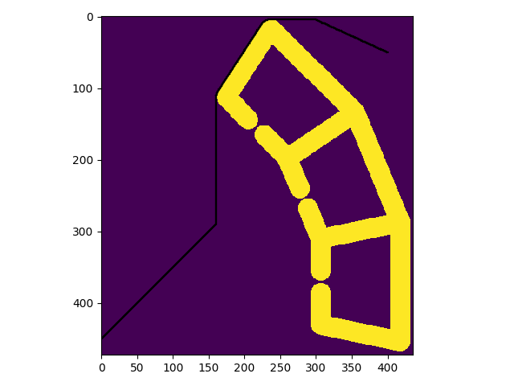
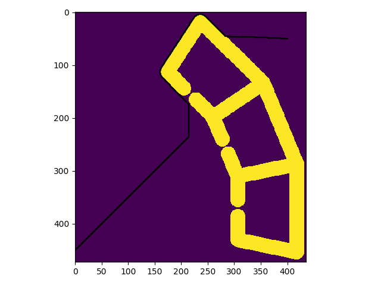
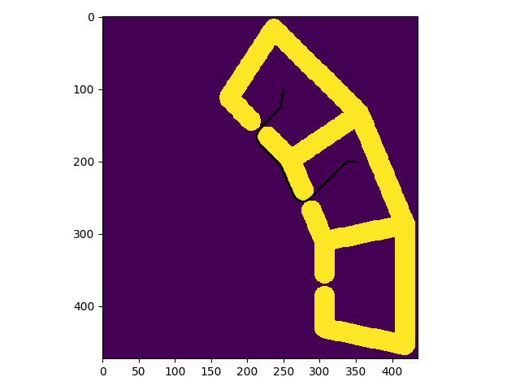

## A* algo
The starting point was set to `100 250` and goal to `200 350`
### $$\epsilon=1$$

cost = 296.13203435596506
exanded nodes = 15934
### $$\epsilon=10$$

expanded nodes: 7350
cost:  296.13203435596506
### $$\epsilon=20$$

expanded nodes: 7092
cost:  296.13203435596506