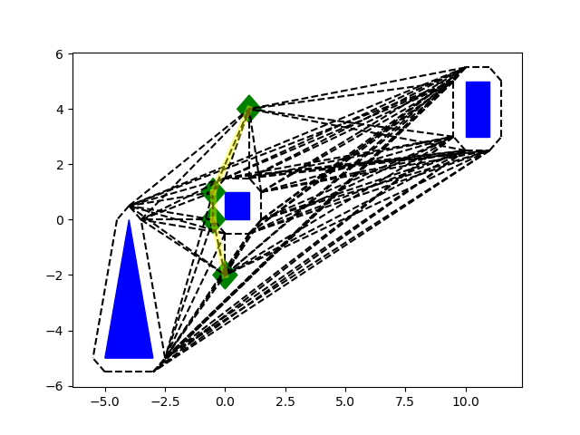

# robotic_motion_planning_course
Robotic motion planning course, Technion 236610 (Taught by Dr. Oren Saltzman).
Homework assignments

# [HW 1](HW1/hw1.ipynb)
Here, Minkowsky sums were calculated and visibility graphs generated.

# [HW 2](HW2/hw2.ipynb)
Here, astar and rrt were implemented.
|A*|RRT|
|--|---|
|||

Final path in red, explored nodes in colour.

# [HW 3](HW3/hw3.ipynb)
Here, multiheuristic A* was implemented.
|Weighted A*| MHA*|
|-----------|-----|
|||

Final path in red, explored nodes in colour.
